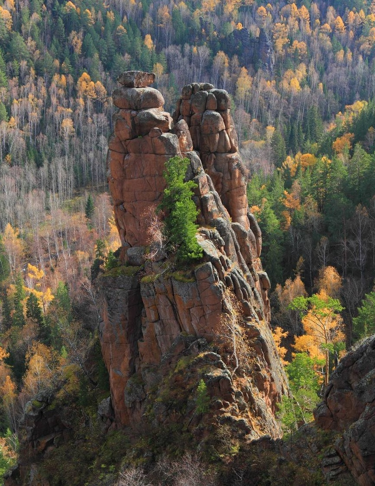

# Инструкция для работы с Git #
Git - это самая популярная в мире система контроля версий, имеющая локальные и удалённые репозитории.

## Подготовка репозитория 
Для создания репозитория необходимо выполнить команду ***git init*** в папке с репозиторием у Вас создатся репозиторий и появится скрытая папка *.git*

## Создание коммитов 
### Git add 
Для добавления измений в коммит используется команда *git add*. Для этого напишите *git add <имя файла>*

### Git status 
Для того, чтобы посмотреть состояние репозитория используется команда **git status**. Для этого необходимо в папке с репозиторием написать git status и вы увидите какие были изменения.

### Git commit
Для того, чтобы создать коммит(сохранение) необходимо выполнить команду ***git commit***. Выполняется она так: *git commit -m "<сообщение к коммиту>*. Все файлы для коммита должны быть **ДОБАВЛЕНЫ** и сообщение к коммиту писать **ОБЯЗАТЕЛЬНО**.

## Перемещения между сохранениями
Для того, чтобы перемещаться между коммитами, используется команда ***git checkout***. Используется она в папке с репозиторием так: *git checkout <номер коммита>*.

## Журнал изменений
Для того, чтобы посмотреть все сделанные изменения в репозитории, используется команда ***git log***. Для этого достаточно выполнить команду *git log* в папке с репозиторием.

# Инструкция для работы с Markdown

## Выделение текста
Чтобы выделить  текст курсивом необходимо его обрамить звездочками (*) или знаком нижнего подчеркивания (_). Например, *Вот так* или _вот так_.

Чтобы выделить текст полужирным, необходимо обрамить его двойными звездочками (**) или двойным знаком нижнего подчеркивания (__). Например, **Вот так** или __Вот так__.

## Списки

Чтобы добавить ненумерованные списки, необходимо пункты выделить звездочкой (*) или знаком +. Например, вот так:
* Элемент 1
* Элемент 2
* Элемент 3
+ Элемент 4

Чтобы добавить нумерованные списки, необходимо пункты пронумеровать
1. Первый элемент
2. Второй элемент
3. Третий элемент

## Работа с изображениями

Чтобы вставить изображение в текст, надо написать следующее: 

## ССылки

## Работа с таблицами

## Цитаты

> Цитата в тексте важна
